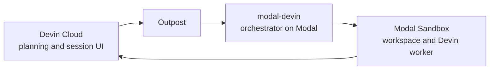

Devin Outposts separates planning from execution. Devin's agent loop remains in
Devin Cloud, while commands, file edits, and repository access happen on compute you
operate.

`modal-devin` supplies the orchestrator for Modal. It connects an outpost to
isolated [Modal Sandboxes](https://modal.com/docs/guide/sandboxes) and manages each
session from startup through cleanup.

## The worker

The Devin worker serves one session. Inside its Sandbox it can run commands, edit
files, use project tools, and reach services allowed by your Modal environment.

The workspace comes from either the current deployed image or a preserved filesystem
from an earlier suspended attempt.

## The orchestrator

The generated Modal application is the orchestrator deployment. It:

- Watches the configured outpost for work.
- Starts one isolated Sandbox for an accepted session.
- Runs the worker and streams its output to Modal logs.
- Preserves the workspace when the session suspends.
- Cleans up compute and makes failed work retryable.

Your generated file exposes deployment policy such as images, secrets, compute,
regions, retries, and schedule. The library keeps the Outposts and Sandbox lifecycle
behind the `Worker` API.

## Trust boundary

The raw Devin credential is kept out of the main session environment. The workload
can still use the limited Outposts capability required to serve its assigned session,
so use least-privilege credentials and separate outposts when trust requirements differ.

## Network requirements

Workers need outbound HTTPS access to Devin and run without inbound ports, a public
IP, or a connection initiated from Devin Cloud.

## Operational model

One generated application represents one outpost deployment. Give deployments unique,
durable names so their Modal resources and resumable work remain independent.

<Card title="Session lifecycle" icon="route" href="/explanation/session-lifecycle" horizontal>
  See what happens when a session is queued, runs, suspends, completes, or fails.
</Card>
