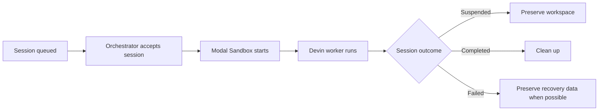

`modal-devin` manages the compute lifecycle for sessions assigned to its Outposts
pool.

## 1. A session is queued

When a user selects your Outposts pool in Devin, the session waits for an available
orchestrator. The deployed Modal application watches that pool.

## 2. The session is accepted

`modal-devin` coordinates with Outposts so only one worker serves an attempt. Modal
may occasionally start duplicate invocations because delivery is retried; a duplicate
that does not own the session exits safely.

## 3. The workspace starts

The session starts from:

- Its preserved filesystem when resuming a suspended session, or
- The latest deployed worker image for a new session or expired snapshot.

The Sandbox must become ready before the Devin worker begins.

## 4. The worker runs

The worker connects outbound to Devin Cloud and executes session tool calls inside
the Sandbox. Its output appears in Modal logs with the Devin session ID.

## 5. The outcome is preserved

| Session outcome | What modal-devin does |
| --- | --- |
| Suspended | Preserves the filesystem for the next attempt |
| Completed or terminated | Removes obsolete recovery state and cleans up compute |
| Final state cannot be confirmed | Preserves recovery data when possible and reports a failure |
| Worker exits unsuccessfully | Reports a failed invocation after recovery handling |

The conservative failure behavior avoids reporting success when recoverable work
could otherwise be lost.

## 6. Compute is cleaned up

The Sandbox is terminated after its state is handled. When an attempt fails, the
session is made available for a later recovery attempt whenever possible.

<Card title="Resumability" icon="clock-rotate-left" href="/explanation/resumability" horizontal>
  Learn which filesystem a resumed session uses and how retention affects recovery.
</Card>
