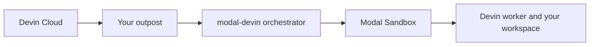

`modal-devin` runs Devin Outposts sessions on Modal. Devin's planning remains in
Devin Cloud while commands, file edits, and repository access happen in isolated
Modal Sandboxes that you control.

Use it when you need:

- Custom tools, repositories, or system packages for Devin sessions.
- Access to services and registries available from your Modal environment.
- Modal compute, memory, region, retry, and scheduling controls.
- A preserved workspace when a Devin session is suspended and resumed.

<Note>
  `modal-devin` is alpha software. Until the first stable release, only the latest
  release on the default branch receives security fixes.
</Note>

## How it fits into Outposts

Outposts has two layers:

1. The **worker** executes one Devin session inside a Modal Sandbox.
2. The **orchestrator** finds queued sessions, manages their compute lifecycle, and
   runs as a Modal application.

Workers need outbound HTTPS access to Devin and run without inbound ports or a public
IP.

## Choose your path

<Columns cols={2}>
  <Card title="Deploy an existing outpost" icon="play" href="/tutorials/first-worker">
    Go from an outpost ID to a verified Modal deployment.
  </Card>
  <Card title="Create a new outpost" icon="wand-magic-sparkles" href="/tutorials/create-an-outpost">
    Create the outpost, credential, and application interactively.
  </Card>
  <Card title="Build the workspace" icon="code" href="/tutorials/custom-workspace">
    Add project source and tools to every new session.
  </Card>
  <Card title="Configure compute" icon="microchip" href="/guides/resources-and-regions">
    Choose resources and placement for session workloads.
  </Card>
</Columns>

## What you control

The setup command generates an ordinary Modal application in your project. Edit it
to choose:

- Project source, tools, dependencies, and Modal Secrets for your functions and workloads.
- CPU, memory, region, retries, schedule, session duration, and snapshot retention.
- Application names, tags, and deployment policy.

`modal-devin` handles queue consumption, worker startup, resumability, credentials,
and cleanup, leaving your application free of lifecycle reimplementation.

## Requirements

- Python 3.11 or newer.
- A Modal account with locally configured credentials.
- A Devin organization with Outposts enabled.
- An existing outpost ID, or the Devin CLI to create one.
- A Devin token authorized to manage the outpost and serve its sessions.

<Card title="Deploy your first worker" icon="arrow-right" href="/tutorials/first-worker" horizontal>
  Follow the shortest path from installation to a verified deployment.
</Card>
