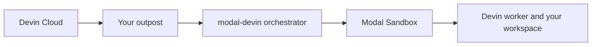

`modal-devin` lets you run Devin's work where your work already lives. Devin plans
in Devin Cloud while commands, file edits, repository access, and workloads run in
isolated Modal Sandboxes you configure and control.

<Note>
  **What is Modal?** Modal is a cloud platform for running code without managing
  servers. You define your environment and compute requirements in Python; Modal
  provisions and runs the infrastructure.
</Note>

That means Devin can use the environment the task actually needs—not a one-size-fits-all
development VM. Give it a GPU for model-serving or training work, a persistent Modal
Volume for large datasets and weights, or access to services and registries available
from your Modal environment.

## Why run Devin on your infrastructure?

Most software work fits in a CPU-only sandbox. Some of the highest-value work does
not: validating a dependency upgrade against production-like hardware, diagnosing a
bug that appears only under GPU load, or tuning an inference server against a real
model and dataset.

Use a Modal-backed outpost when Devin needs:

- Specialized compute, including GPUs, memory configurations, or a specific region.
- A persistent workspace or shared data that should not be downloaded for every session.
- Custom tools, project source, system packages, and credentials.
- Connectivity to the services and registries your Modal environment can reach.
- The deployment and operational controls you already use with Modal.

## How it works

`modal-devin` connects an outpost to Modal in two parts:

1. The **orchestrator** watches your outpost for queued sessions and manages their
   compute lifecycle as a Modal application.
2. The **worker** runs each accepted session inside its own Modal Sandbox.

Workers need outbound HTTPS access to Devin and run without inbound ports or a public
IP.



## Get started

<Columns cols={2}>
  <Card title="Create a new outpost" icon="wand-magic-sparkles" href="/tutorials/create-an-outpost">
    Run one guided command to register an outpost, generate your app, and deploy it.
  </Card>
  <Card title="Deploy an existing outpost" icon="play" href="/tutorials/first-worker">
    Connect an outpost ID to a verified Modal deployment.
  </Card>
  <Card title="Build the workspace" icon="code" href="/tutorials/custom-workspace">
    Add project source, tools, packages, data, or Volumes to every session.
  </Card>
  <Card title="Configure compute" icon="microchip" href="/guides/resources-and-regions">
    Choose the compute, GPU, memory, and placement for session workloads.
  </Card>
</Columns>

## Your generated Modal application

Run the guided setup from the project that will own the outpost:

```bash
uvx run modal-devin init
```

It creates an outpost, writes a minimal Modal application to your repository, and can
deploy it immediately. The generated application is ordinary code you own: customize
it as your workloads evolve.

You choose:

- Project source, tools, dependencies, Volumes, and Modal Secrets.
- CPU, GPU, memory, region, retries, schedule, and deployment policy.
- How much state to preserve when a Devin session is suspended and resumed.

`modal-devin` handles queue consumption, worker startup, resumability, scoped session
credentials, and cleanup—so you can focus on the environment, not reimplementing the
Outposts lifecycle.

<Note>
  `modal-devin` is alpha software. Until the first stable release, only the latest
  release on the default branch receives security fixes.
</Note>

## Requirements

- Python 3.11 or newer.
- A Modal account with locally configured credentials.
- A Devin organization with Outposts enabled.
- An existing outpost ID, or permission to create one through the setup wizard.
- A Devin token authorized to manage the outpost and serve its sessions.

<Card title="Deploy your first worker" icon="arrow-right" href="/tutorials/first-worker" horizontal>
  Follow the shortest path from installation to a verified deployment.
</Card>
